# Vision-Guided Automated Probe Alignment System for Wafer-Level Testing

A low-cost (~$200 USD), fully integrated system that automates micron-scale alignment between tungsten microprobes and semiconductor bond pads for wafer-level electrical testing — built as a Final Year Project in Robotics & Mechatronics Engineering at Monash University Malaysia, and awarded **Best FYP Report** by the department.

Commercial probe stations solve this alignment problem with proprietary vision systems and high-resolution servo stages costing $50,000–$500,000, putting them out of reach for teaching labs and small/medium enterprises. This project builds a functional equivalent from off-the-shelf components and 3D-printed parts, combining a custom motorised XY stage, a YOLOv11-based vision pipeline, magnetic encoder feedback, and an automated microprobe mechanism into a single reproducible, open-source workflow.

  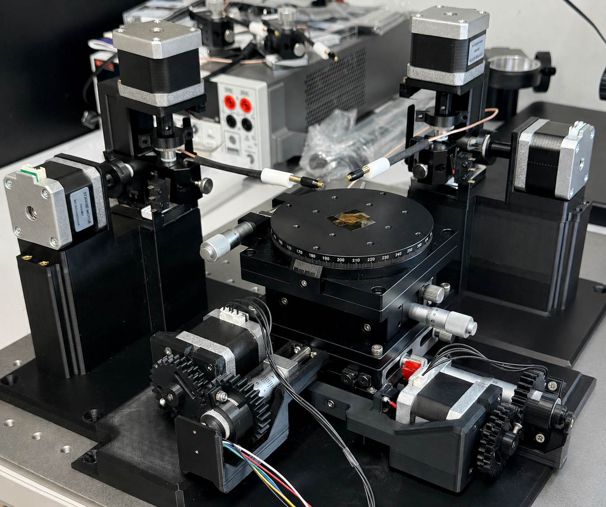

## What it does

1. Drives a custom motorised XY stage using 3D-printed anti-backlash gear couplings and NEMA17 steppers
2. Automatically scans the wafer, using YOLOv11 to detect all bond pads in real time — reliably, even on damaged or oxidised pads where classical template matching fails outright
3. Computes device (crossbar) centre coordinates from detected pads and stores them in a persistent registry with a live wafer minimap
4. Recentres the stage on any selected device using a three-stage correction chain — encoder drift correction, magnetic encoder step correction, and two-pass image-guided fine centering — pushing positioning error from ~300 µm down to **below 43 µm**
5. Drives a two-axis microprobe mechanism to make electrical contact with the aligned device

The system breaks down into three major phases — live bond pad detection, device centering, and automated probing:

  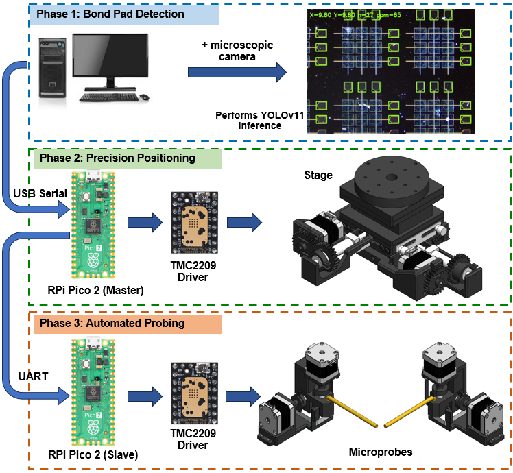

## System Architecture

Four subsystems, coordinated over USB serial:

- **Motorised XY wafer stage** — driven by NEMA17 steppers through custom 3D-printed spring-loaded split-gear anti-backlash couplings. 25 mm travel per axis, 0.156 µm/step theoretical resolution at 16× microstepping.
- **Firmware (Raspberry Pi Pico 2W / RP2350A)** — PIO-based, dual-core motion control (Core 0: USB serial + X-axis, Core 1: Y-axis) for jitter-free, simultaneous XY motion via TMC2209 stepper drivers. Trapezoidal S-curve motion profiles, safe homing logic, and MT6835 21-bit magnetic encoder integration for closed-loop correction.
- **Vision & scan pipeline (host, PySide6 desktop app)** — a YOLOv11 model (replacing an earlier OpenCV template-matching approach that failed on damaged/oxidised pads) detects bond pads per frame; a phase-correlation calibration procedure maps pixel space to stage space; an automated unidirectional scan builds a full device registry.
- **Microprobe mechanism** — two independently-actuated probe carriages (one per crossbar bus line), each with a lateral axis and a Z-axis for pad contact, mounted symmetrically on the stage base.

  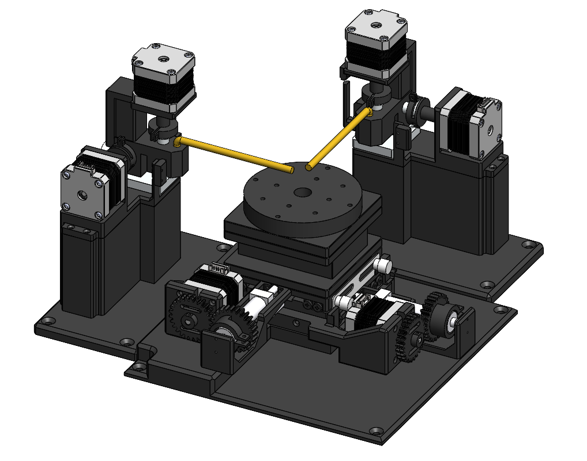
  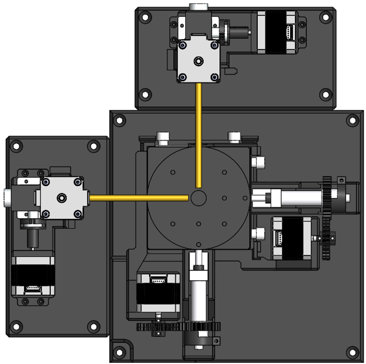

### Desktop Application

The host runs a PySide6 desktop application that manages the live camera feed, orchestrates scans, and runs YOLO inference — the same interface used to trigger scans, review the wafer minimap, and send the stage to any detected device.

  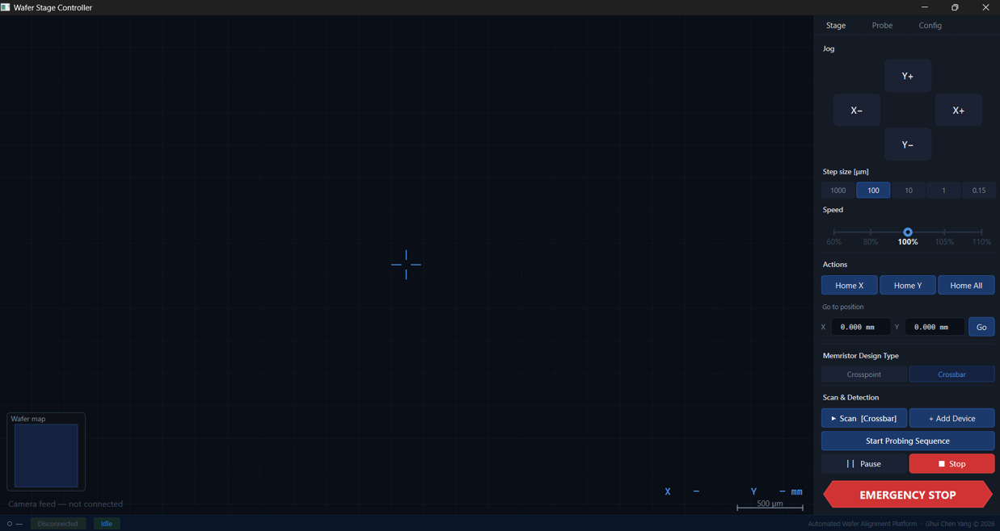

## Bond Pad Detection (YOLOv11)

Bond pads on the test wafer ranged from clean to heavily damaged and oxidised. An initial OpenCV template-matching approach failed outright on damaged pads — illumination variation and physical damage from prior probe contact both broke it. A YOLOv11 model, trained across the full range of pad conditions, detects pads reliably in every case:

  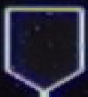
  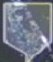
  
  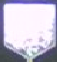

Live detection during a scan, with bounding boxes drawn over every detected pad:

  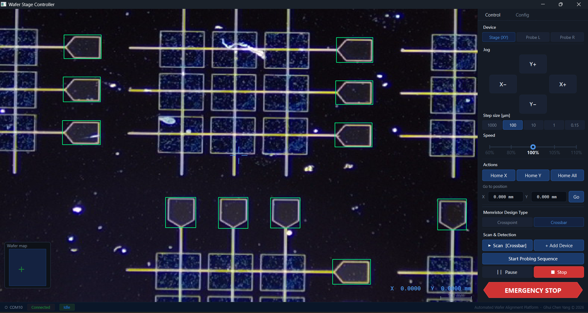

This robustness is what took full pipeline recovery to 100% across 30 repeated scans, recovering all 144 pads and all 24 device centres every time.

## Wafer Minimap

Detected devices are plotted onto a live minimap as the scan progresses, closely matching the actual layout of the physical wafer sample:

  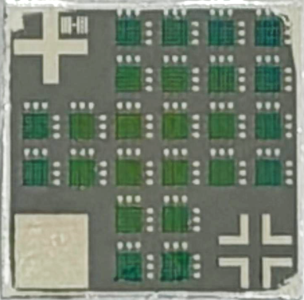
  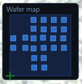

Clicking any device on the minimap and pressing "Go To" sends the stage to recentre on that device automatically:

  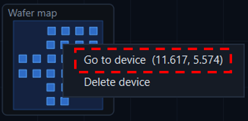

## Positioning Correction

A 15-cycle backlash test revealed a sharp asymmetry between the two stage axes: the Y axis had a small, highly repeatable systematic offset, but the X axis — which has to carry both its own stage layer and the entire Y layer above it — showed erratic scatter with individual errors up to ±150 µm. This made step-count-only positioning unusable on X.

A three-stage correction chain closes that gap, taking the stage from a rough scan-registered position down to a precisely centred device:

  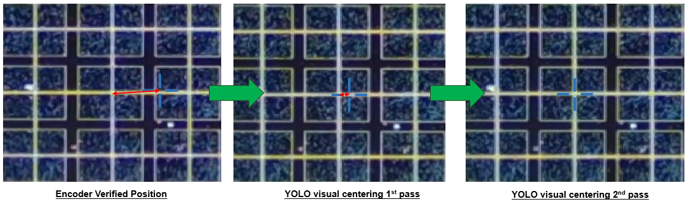

1. **Encoder-verified movement** gets the stage close to the device centre
2. **First YOLO fine-centering pass** brings it substantially closer
3. **Second YOLO fine-centering pass** achieves precise centring — residual error below 43 µm

## Automated Probing

Two probe assemblies are mounted symmetrically on the stage base, one per crossbar bus line. The left probe steps along and lands on the right column of bond pads, while the right probe steps along and lands on the top row:

  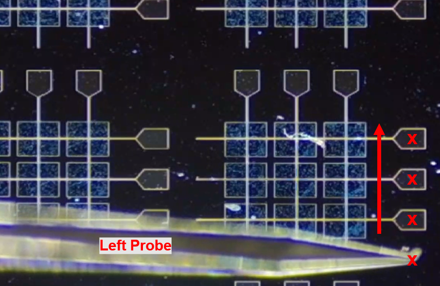
  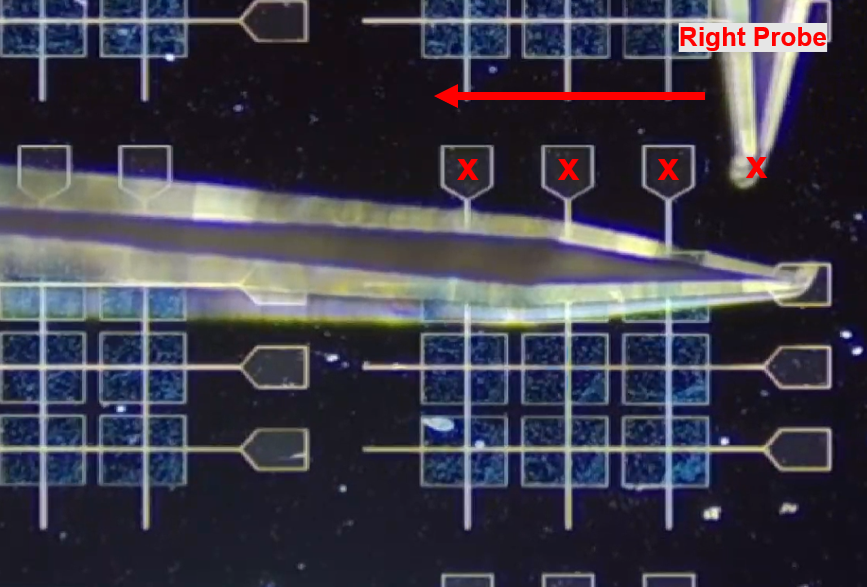

Each probe assembly is a two-motorised-axis carriage — a lateral axis to step between pad positions, and a Z-axis to lower the needle onto the pad for contact. Image below shows the assembly of one side of the probe assembly.

  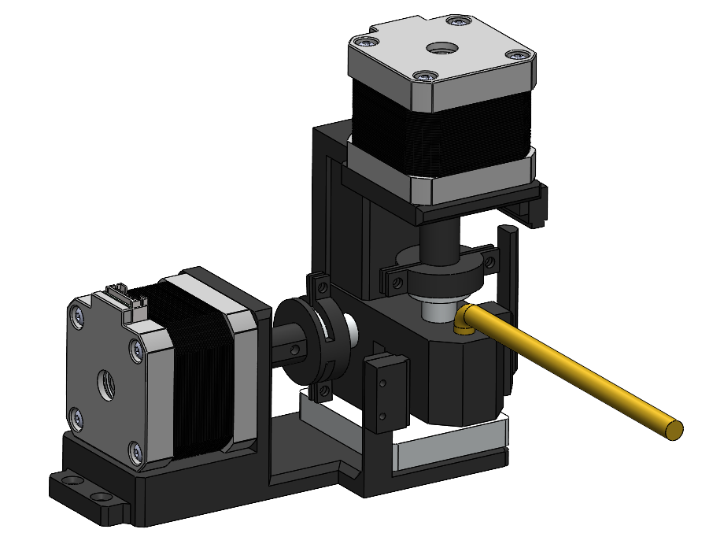

## See It In Action

### YOLO live detection demo

  
  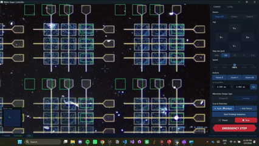

  
  https://github.com/user-attachments/assets/2e65f433-c4e1-4870-8737-4bd043e61879

### Device positioning & centering

  
  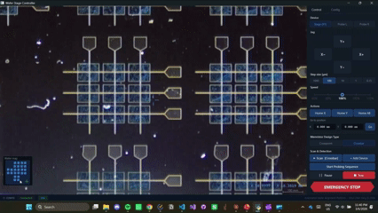

  
  https://github.com/user-attachments/assets/fc8239ff-43dc-4b65-8022-78ce584394f2

### Automated Probe Positioning

  
  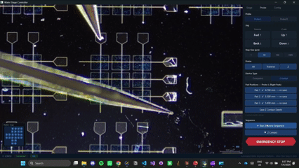

  

  https://github.com/user-attachments/assets/283223e4-f84b-474d-8864-223d71bc67b3

## Results at a glance

| Metric | Result |
|---|---|
| Bond pad detection | All 144/144 pads and all 24/24 device centres recovered, in all 30 repeated full-wafer scans |
| YOLOv11 model | mAP@0.5 = 0.872, mAP@0.5:0.95 = 0.820, precision = 0.995, recall = 0.860 (100 epochs, 150 labelled images) |
| Final positioning accuracy | <43 µm typical residual (≤87 µm worst case) — well within the 150 µm pad half-width |
| Probe contact | 100% lateral on-pad success (150/150 pads × 2 probes) and 100% electrical contact success across 50 devices |
| Full wafer scan time | <7 minutes per full-wafer scan |
| Total hardware cost | ~$200 USD vs. $50,000–$500,000 for commercial probe stations |

## Hardware

- NEMA17 stepper motors (17HS4401) with TMC2209 drivers (StealthChop2, MicroPlyer interpolation)
- Raspberry Pi Pico 2W (RP2350A) — PIO + dual-core motion control
- MT6835 21-bit absolute magnetic rotary encoders (both axes)
- Microscopic board camera with high-magnification zoom lens
- All structural/custom parts (motor mounts, gear housings, limit switch brackets, encoder mounts, base platform) designed in CAD and 3D-printed in PLA

## Author

**Ghui Chen Yang** — Robotics & Mechatronics Engineering, Monash University Malaysia
Supervised by Dr. Patrick Ho, Department of Electrical and Computer Systems Engineering

This project was Awarded Best FYP Report for the Department of Robotics & Mechatronics Engineering.
